  

**who lee is Lee.** A builder in Glasgow who writes operating systems in C and ships tools that do exactly what they claim.

- **LestraOS** — x86_64 operating system from scratch ([repo](https://github.com/who-lee/LestraOS))
- **picklestramk** — pure-C GGUF loader, no llama.cpp, no ollama
- **UBLESTRAMK** — root hiding across Magisk, KernelSU and APatch
- **Rebler** — default-deny root hider, no fake attestation
- **clawless-explorer** — Kotlin file explorer
- **agentic-web-bridge** — local-first browser automation over CDP

*la peace-lee-organised yetty.*
