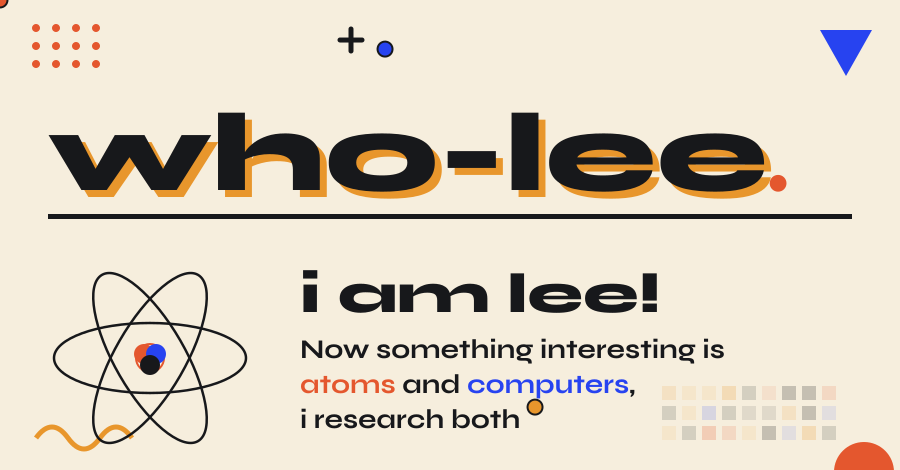

  

 

I research atoms and computers. I build kernels, local-first tools and AI plumbing from Nairobi.

## Work

| | | |
|:-:|---|---|
| 🟧 | **LestraOS** | Custom x86_64 OS from scratch: kernel, drivers, libc and a desktop environment. |
| 🟦 | **[openpics](https://github.com/who-lee/openpics)** | Local-first picture browser for Windows with background removal and an MCP server so AI agents can search and edit photos. Nothing leaves your machine. |
| 🟥 | **[AAMT](https://aamt.lestramk.org)** | AI-matched engineering talent marketplace for Africa. |
| ⬛ | **[Lestramk](https://lestramk.org)** | Independent engineering practice. Cronas is its private security arm. |

## Stack

## Numbers

